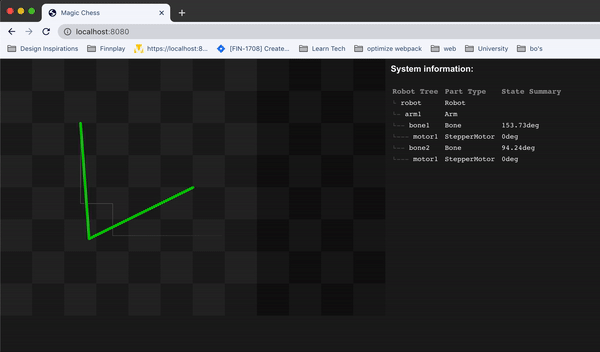

# Raspberry Pi Chess

# ! Project is in development, follow 

It's fun to play chess, even more so when you play against an invisible oponent and pieces move around the board just by themselves!

I decided to put all the code and specifications for anyone to use freely! _PRs are welcome_.

### This project contains
- Code to run on Raspberry Pi
- ```[TODO]``` List of parts you need
- ```[TODO]``` Instructions on how to connect boards for online play.

## Web interface

